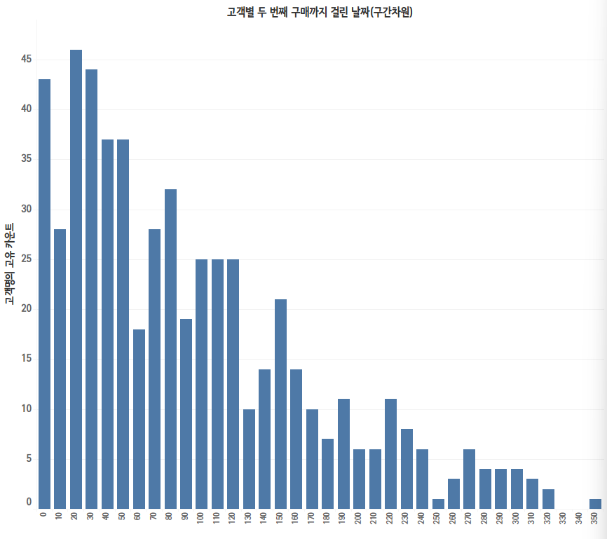
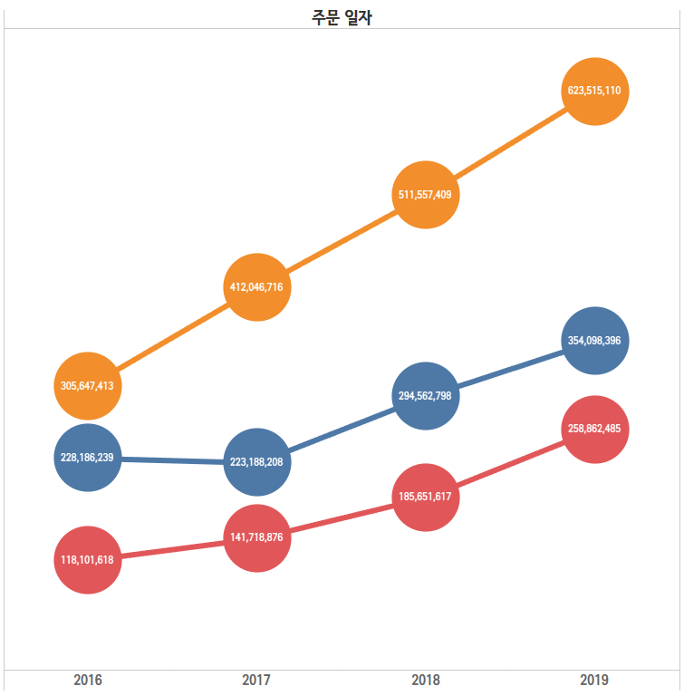
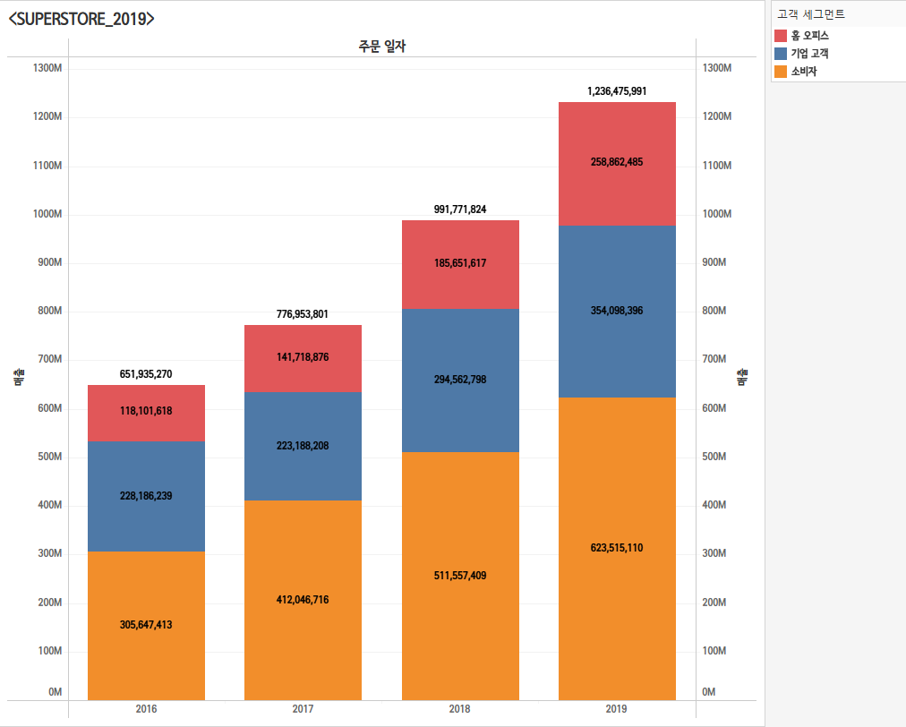
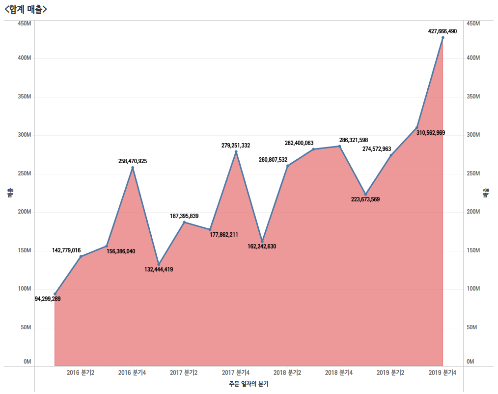
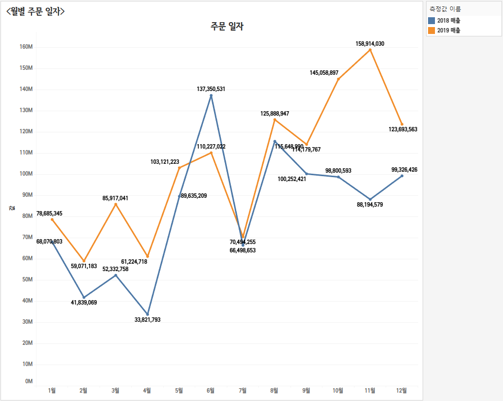
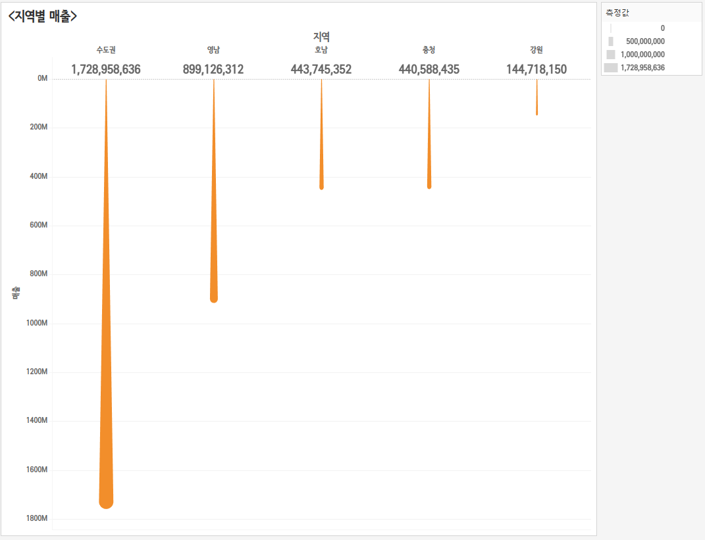
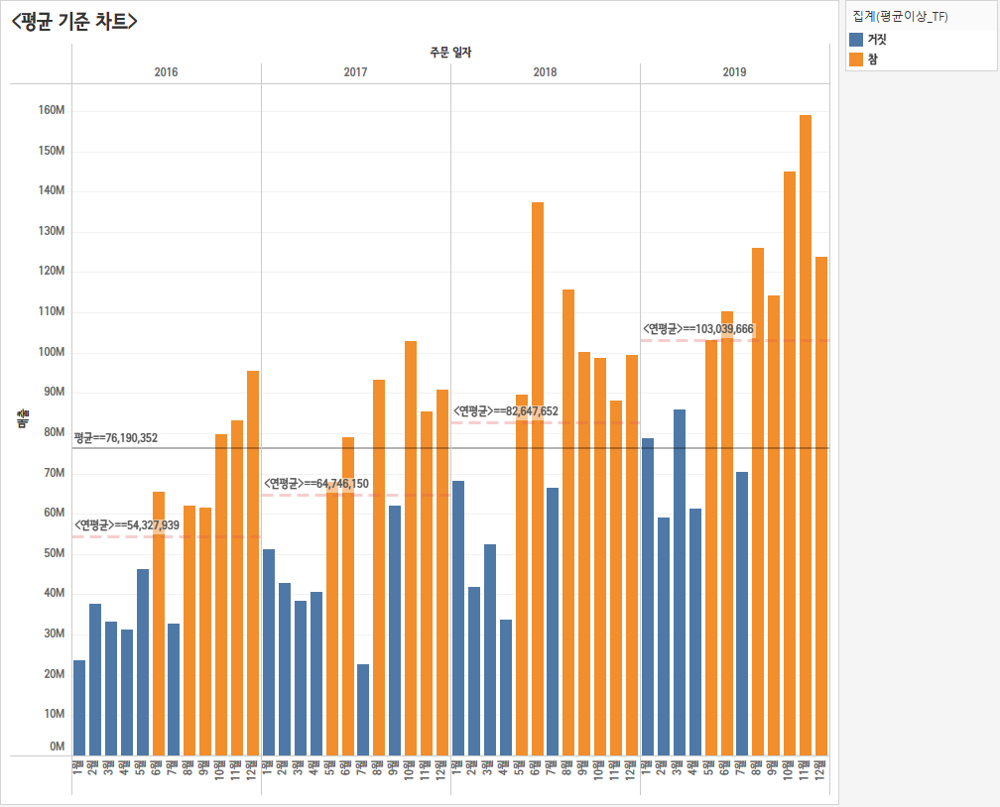
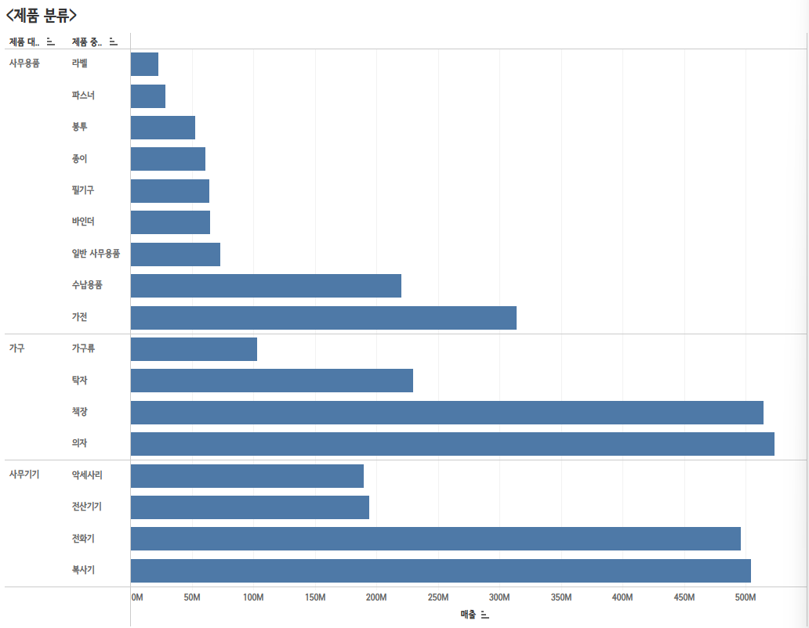
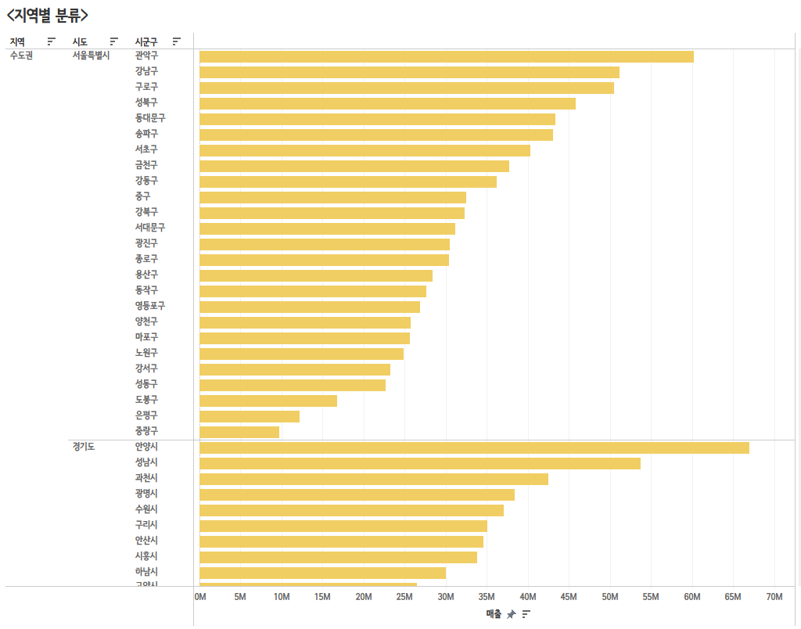
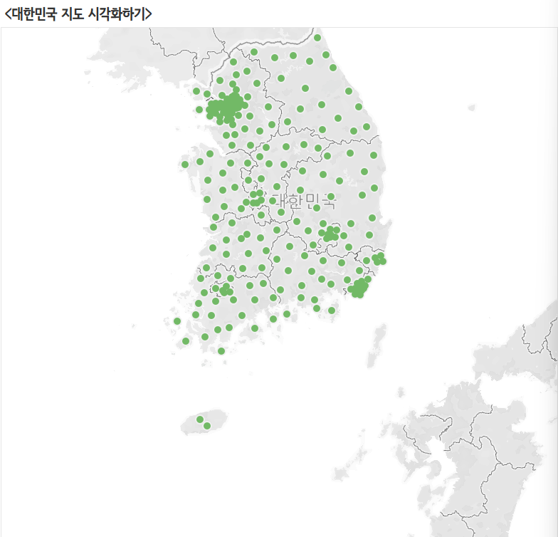

# 1. 고객별 재구매 시기 데이터 분석 태블로 시각화

이 그래프는 고객별 두 번째 구매까지 걸린 날 수를 나타내는 히스토그램입니다. 

주요 내용은 다음과 같습니다: 
세로축: 고객의 수 또는 빈도를 나타내며, 특정 기간 내에 두 번째 구매까지 걸린 날 수의 빈도를 보여줍니다. 
가로축: 두 번째 구매까지 걸린 날 수를 나타내며, 구간별로 나누어져 있습니다(예: 0-10일, 10-20일 등).

주요 관찰 포인트: 
구매 패턴: 0일에서 50일 사이의 구간에서 고객의 두 번째 구매까지 걸린 날 수가 가장 많이 분포되어 있습니다. 특히, 0일에서 10일 사이의 구간에서 가장 높은 빈도를 보이며, 이는 많은 고객이 첫 구매 후 빠르게 두 번째 구매를 한다는 것을 시사합니다. 
빈도 감소: 50일 이후로는 빈도가 점차 감소하는 경향을 보이며, 100일 이후에는 상대적으로 적은 수의 고객이 두 번째 구매를 한 것으로 나타납니다. 
장기 고객: 200일 이상의 구간에서도 몇몇 고객이 두 번째 구매를 한 것으로 보이지만, 전체적으로는 빈도가 낮습니다. 이는 장기적으로 고객이 재구매하는 비율이 낮아짐을 나타낼 수 있습니다.

이 그래프는 고객의 재구매 행동을 분석하는 데 유용하며, 마케팅 전략이나 고객 관리 방안을 세우는 데 필요한 인사이트를 제공할 수 있습니다.

# 2. 연간 매출액 추이 그래프 시각화

이 그래프는 2016년부터 2019년까지의 주문 데이터 변화를 선 그래프로 나타낸 것입니다. 주요 내용은 다음과 같습니다:

세로축: 주문 금액을 나타내며, 단위는 만 원입니다. 
가로축: 연도를 표시하며, 2016년, 2017년, 2018년, 2019년으로 나뉘어 있습니다. 

각 연도별 주문 금액이 세 가지 색상으로 구분된 선으로 표시됩니다: 
오렌지색: 소비자 매출 
파란색: 기업 고객 매출 
빨간색: 홈 오피스 매출

주요 관찰 포인트: 
소비자 매출 (오렌지색):전체적으로 꾸준한 증가세를 보이며, 2016년 305,647,413에서 2019년 623,515,110으로 크게 성장했습니다. 
기업 고객 매출 (파란색):매출이 2016년 228,186,239에서 2019년 354,098,396으로 증가하였지만, 소비자 매출에 비해 증가폭이 상대적으로 작습니다. 
홈 오피스 매출 (빨간색):홈 오피스 매출은 2016년에 비해 감소세를 보이다가 2019년에는 약간의 회복이 있는 모습을 보입니다. 2016년 118,101,618에서 2019년 258,862,485로 증가했으나, 여전히 두 다른 카테고리에 비해 낮은 수준입니다.

이 그래프는 각 고객 세그먼트의 매출 변화를 시각적으로 비교할 수 있게 해 주며, 소비자 매출의 중요성과 기업 고객 매출의 성장 가능성을 강조하는 데 유용합니다.

# 3. 고객세그먼트별 매출액 누적막대차트

이 그래프는 2016년부터 2019년까지의 매출 데이터를 시각화한 것입니다. 주요 내용은 다음과 같습니다:

세로축: 매출 금액을 나타내며, 단위는 만 원입니다. 
가로축: 연도를 표시하며, 2016년, 2017년, 2018년, 2019년으로 나뉘어 있습니다. 

각 연도의 매출은 세 가지 색상으로 구분된 막대로 표시됩니다: 
오렌지색: 소비자 매출 
파란색: 기업 고객 매출 
빨간색: 홈 오피스 매출

주요 관찰 포인트: 
전체 매출 증가: 2016년부터 2019년까지 매출이 지속적으로 증가하는 추세를 보입니다. 특히 2019년에 가장 높은 매출을 기록했습니다. 
소비자 매출: 소비자 매출이 전체 매출에서 가장 큰 비중을 차지하고 있으며, 매년 증가하는 모습을 보입니다. 
기업 고객 매출: 기업 고객 매출도 일정 부분 증가하고 있지만, 소비자 매출에 비해 상대적으로 낮은 수준입니다. 
홈 오피스 매출: 홈 오피스 매출은 전체 매출에서 가장 적은 비중을 차지하지만, 그래도 매년 증가하고 있는 모습을 보입니다.

이 그래프는 각 고객 세그먼트별 매출의 변화를 한눈에 파악할 수 있도록 도와주며, 소비자 매출의 중요성을 강조하는 데 유용합니다.

# 4. 연도별 매출액 영역차트

이 그래프는 2016년부터 2019년까지의 총 매출 변화를 시각화한 것입니다. 주요 내용은 다음과 같습니다:

세로축: 매출 금액을 나타내며, 단위는 만 원입니다. 
가로축: 연도와 분기를 표시하며, 각 분기별로 나누어져 있습니다(예: 2016년 1분기, 2016년 2분기 등). 
선 그래프: 각 분기의 총 매출을 나타내며, 점으로 표시된 매출 수치가 연결된 선으로 표현됩니다. 
음영 영역: 선 아래의 음영 영역은 각 분기의 매출 총합을 강조하고 있습니다. 

주요 관찰 포인트: 
전체 매출 증가 추세: 그래프를 보면 전체적으로 매출이 증가하는 경향이 있으며, 특히 2017년 2분기와 2018년 1분기에 가장 높은 매출을 기록했습니다. 
변동성: 매출은 분기마다 변동성이 있으며, 특히 2017년과 2018년 사이에 몇 차례 큰 변동이 나타났습니다. 예를 들어, 2017년 2분기에는 279,251,332로 최고치를 기록한 후, 다음 분기에는 급격히 감소하는 모습을 보입니다. 
2019년의 성장: 2019년 1분기에는 310,562,969의 매출을 기록하며, 이전 분기보다 증가세를 보이고 있습니다. 2019년 2분기에는 427,666,490으로 더 큰 성장을 나타냈습니다. 

이 그래프는 특정 기간 동안의 매출 변화를 시각적으로 분석할 수 있게 해 주며, 계절적 요인이나 특정 이벤트가 매출에 미치는 영향을 이해하는 데 유용합니다.

# 5. 월별 매출액 연도 비교 라인차트

이 그래프는 2018년과 2019년의 월별 주문 데이터를 비교하여 나타낸 것입니다. 주요 내용은 다음과 같습니다:

세로축: 주문 금액을 나타내며, 단위는 만 원입니다. 
가로축: 월을 나타내며, 1월부터 12월까지의 데이터가 포함되어 있습니다. 
파란색 선: 2018년의 매출을 나타냅니다. 
주황색 선: 2019년의 매출을 나타냅니다.

주요 관찰 포인트: 전반적인 추세: 두 해 모두 매출이 월별로 변동성이 있으나, 2019년의 매출이 전반적으로 더 높은 경향을 보입니다. 특히 5월과 6월에 큰 차이를 보입니다.
피크와 저점:2019년 6월에 158,914,030으로 가장 높은 매출을 기록하였고, 이는 2018년 같은 달보다 크게 증가한 수치입니다. 반면, 2018년 2월에는 59,071,183으로 가장 낮은 매출을 기록하며, 2019년 2월에도 비슷한 수준의 저조한 매출을 보입니다. 
하반기 비교:2019년 하반기에는 매출이 상대적으로 안정세를 보이며, 11월과 12월에도 90M 이상의 매출을 유지하고 있습니다. 2018년 하반기의 매출은 다소 불규칙하게 변동하며, 12월에는 88,194,579로 마감하였습니다. 

이 그래프는 두 해의 월별 주문 변동을 비교하여, 연도별 성과를 분석하고, 특정 월의 매출 패턴을 이해하는 데 유용합니다.

# 6. 라운드형 막대 차트

이 그래프는 지역별 매출을 나타내고 있습니다. 각 지역의 매출 수치를 막대 그래프로 표현하고 있으며, 주요 내용은 다음과 같습니다:

세로축: 매출 금액을 나타내며, 단위는 만 원입니다. 
가로축: 지역을 나타내며, 각 지역의 매출이 막대의 길이로 표시됩니다.

주요 지역별 매출은 다음과 같습니다:

수도권: 1,728,958,636으로 가장 높은 매출을 기록하고 있습니다. 
영남: 899,126,312로 두 번째로 높은 매출을 보이고 있습니다. 
지역: 443,745,352로 상대적으로 낮은 매출입니다. 
충청: 440,588,435로 영남과 비슷한 수준입니다. 
강원: 144,718,150으로 가장 낮은 매출을 기록하고 있습니다.

이 그래프를 통해 수도권의 매출이 전체 매출에서 차지하는 비중이 크고, 다른 지역에 비해 상대적으로 높은 매출을 보임을 알 수 있습니다.

# 7. 평균 기준 차트
 

이 그래프는 2016년부터 2019년까지의 평균 기준을 나타내고 있습니다. 세로축은 수치를 나타내며, 가로축은 월을 기준으로 연도별로 나뉘어 있습니다.

연도별 데이터: 각 연도의 데이터는 두 가지 색상으로 구분됩니다. 파란색 막대는 '거짓'을, 주황색 막대는 '참'을 나타냅니다. 
평균선: 그래프에는 각 연도별 평균값이 수평선으로 표시되어 있으며, 각 연도의 평균값이 그래프에 명시되어 있습니다. 2016년부터 2019년까지의 평균값은 점차 증가하는 추세를 보이고 있습니다. 
전반적인 추세: 2019년에는 특히 주황색 막대가 높아져 '참'의 수치가 크게 증가했음을 알 수 있습니다. 이는 이 시기에 '참'에 해당하는 데이터의 값이 증가했음을 나타냅니다. 

이 그래프를 통해 연도별 데이터의 변화와 평균값의 추세를 한눈에 파악할 수 있습니다.

# 8. 계층 차트

이 그래프는 제품 분류에 따른 매출을 나타내고 있습니다. 주요 내용은 다음과 같습니다:

세로축: 제품의 종류를 나타내며, 다양한 제품 카테고리가 나열되어 있습니다. 
가로축: 매출 금액을 나타내며, 단위는 만 원입니다. 
막대 그래프: 각 제품 카테고리별 매출이 막대의 길이로 표현되어 있습니다. 막대가 길수록 해당 제품의 매출이 높음을 의미합니다.

주요 제품 카테고리는 다음과 같습니다:

사무용품: 여러 사무용품이 포함되어 있으며, 전체 매출에서 높은 비중을 차지하는 것으로 보입니다. 
가전: 가전제품 카테고리도 상당한 매출을 기록하고 있습니다. 
사무기기: 다양한 사무기기가 포함되어 있으며, 이 또한 높은 매출을 나타내고 있습니다.

이 그래프를 통해 각 제품 카테고리의 매출 규모를 비교하고, 어떤 제품군이 상대적으로 높은 매출을 기록하고 있는지를 한눈에 파악할 수 있습니다.

# 9. 지역계층 차트

이 그래프는 지역별 매출을 나타내고 있습니다. 주요 내용은 다음과 같습니다: 

세로축: 지역을 나타내며, 서울특별시와 경기도의 구별로 나뉘어 있습니다. 각 지역 이름이 세로로 나열되어 있습니다. 
가로축: 매출 금액을 나타내며, 단위는 만 원입니다. 
막대 그래프: 각 지역별 매출이 노란색 막대로 표시되어 있으며, 막대의 길이가 해당 지역의 매출 규모를 나타냅니다.

주요 관찰 포인트: 
서울특별시: 강남구, 관악구, 서초구 등 주요 지역에서 상대적으로 높은 매출을 기록하고 있습니다. 특히 강남구가 가장 높은 매출을 나타내며, 이는 상업 활동이 활발한 지역임을 시사합니다.

경기도: 경기도의 여러 도시들도 매출이 분포되어 있으며, 안양시와 수원시가 특히 높은 매출을 보이고 있습니다. 
경기도 내 다양한 지역이 서울과 인접해 있어 상업적 활동이 활발한 것으로 보입니다. 

이 그래프는 각 지역의 매출 차이를 시각적으로 비교할 수 있게 해 주며, 특정 지역의 상업적 특성을 이해하는 데 유용합니다.

# 10. 지리적 역할 부여하기

이 그래프는 대한민국의 지도를 나타내고 있으며, 특정 지역에 대한 정보를 시각적으로 표현하고 있습니다. 주요 내용은 다음과 같습니다:

지도: 한국의 지도를 배경으로 하여, 특정 지역을 강조하기 위해 초록색 점들이 표시되어 있습니다. 
초록색 점: 각 점은 특정 지역이나 장소를 나타내며, 점의 밀도나 분포를 통해 해당 지역의 중요성이나 집중도를 파악할 수 있습니다. 
전반적인 분포: 점들이 고르게 분포되어 있거나 특정 지역에 집중되어 있는 모습을 통해 지역 간의 차이나 분포의 특성을 이해할 수 있습니다. 

이 지도는 데이터의 지리적 분포를 시각화하여, 특정 지역에 대한 분석이나 연구의 기초 자료로 활용될 수 있습니다.
