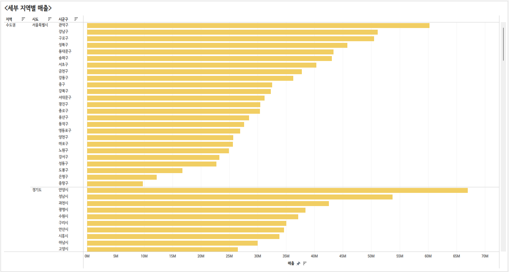

# 1. 고객별 재구매 시기

이 그래프는 고객별 두 번째 구매까지 걸린 날 수를 나타내는 히스토그램입니다. 

주요 내용은 다음과 같습니다:
- 세로축: 고객의 수 또는 빈도를 나타내며, 특정 기간 내에 두 번째 구매까지 걸린 날 수의 빈도를 보여줍니다. 
- 가로축: 두 번째 구매까지 걸린 날 수를 나타내며, 구간별로 나누어져 있습니다(예: 0-10일, 10-20일 등).

주요 관찰 포인트:
- 구매 패턴: 0일에서 50일 사이의 구간에서 고객의 두 번째 구매까지 걸린 날 수가 가장 많이 분포되어 있습니다. 특히, 0일에서 10일 사이의 구간에서 가장 높은 빈도를 보이며, 이는 많은 고객이 첫 구매 후 빠르게 두 번째 구매를 한다는 것을 시사합니다. 
- 빈도 감소: 50일 이후로는 빈도가 점차 감소하는 경향을 보이며, 100일 이후에는 상대적으로 적은 수의 고객이 두 번째 구매를 한 것으로 나타납니다. 
- 장기 고객: 200일 이상의 구간에서도 몇몇 고객이 두 번째 구매를 한 것으로 보이지만, 전체적으로는 빈도가 낮습니다. 이는 장기적으로 고객이 재구매하는 비율이 낮아짐을 나타낼 수 있습니다.

이 그래프는 고객의 재구매 행동을 분석하는 데 유용하며, 마케팅 전략이나 고객 관리 방안을 세우는 데 필요한 인사이트를 제공할 수 있습니다.

# 2. 연간 매출액 추이 그래프

이 그래프는 2016년부터 2019년까지의 주문 데이터 변화를 선 그래프로 나타낸 것입니다. 

주요 내용은 다음과 같습니다:
- 세로축: 주문 금액을 나타내며, 단위는 만 원입니다. 
- 가로축: 연도를 표시하며, 2016년, 2017년, 2018년, 2019년으로 나뉘어 있습니다. 

각 연도별 주문 금액이 세 가지 색상으로 구분된 선으로 표시됩니다:
- 오렌지색: 소비자 매출 
- 파란색: 기업 고객 매출 
- 빨간색: 홈 오피스 매출

주요 관찰 포인트:
- 소비자 매출 (오렌지색):전체적으로 꾸준한 증가세를 보이며, 2016년 305,647,413에서 2019년 623,515,110으로 크게 성장했습니다. - 기업 고객 매출 (파란색):매출이 2016년 228,186,239에서 2019년 354,098,396으로 증가하였지만, 소비자 매출에 비해 증가폭이 상대적으로 작습니다. 
- 홈 오피스 매출 (빨간색):홈 오피스 매출은 2016년에 비해 감소세를 보이다가 2019년에는 약간의 회복이 있는 모습을 보입니다. 2016년 118,101,618에서 2019년 258,862,485로 증가했으나, 여전히 두 다른 카테고리에 비해 낮은 수준입니다.

이 그래프는 각 고객 세그먼트의 매출 변화를 시각적으로 비교할 수 있게 해 주며, 소비자 매출의 중요성과 기업 고객 매출의 성장 가능성을 강조하는 데 유용합니다.

# 3. 고객세그먼트별 매출액 누적막대차트

이 그래프는 2016년부터 2019년까지의 매출 데이터를 시각화한 것입니다. 

주요 내용은 다음과 같습니다: 
- 세로축: 매출 금액을 나타내며, 단위는 만 원입니다. 
- 가로축: 연도를 표시하며, 2016년, 2017년, 2018년, 2019년으로 나뉘어 있습니다. 

각 연도의 매출은 세 가지 색상으로 구분된 막대로 표시됩니다: 
- 오렌지색: 소비자 매출 
- 파란색: 기업 고객 매출 
- 빨간색: 홈 오피스 매출

주요 관찰 포인트: 
- 전체 매출 증가: 2016년부터 2019년까지 매출이 지속적으로 증가하는 추세를 보입니다. 특히 2019년에 가장 높은 매출을 기록했습니다. 
- 소비자 매출: 소비자 매출이 전체 매출에서 가장 큰 비중을 차지하고 있으며, 매년 증가하는 모습을 보입니다. 
- 기업 고객 매출: 기업 고객 매출도 일정 부분 증가하고 있지만, 소비자 매출에 비해 상대적으로 낮은 수준입니다. 
- 홈 오피스 매출: 홈 오피스 매출은 전체 매출에서 가장 적은 비중을 차지하지만, 그래도 매년 증가하고 있는 모습을 보입니다.

이 그래프는 각 고객 세그먼트별 매출의 변화를 한눈에 파악할 수 있도록 도와주며, 소비자 매출의 중요성을 강조하는 데 유용합니다.

# 4. 분기별 합계 매출 그래프

이 그래프는 2016년부터 2019년까지의 총 매출 변화를 시각화한 것입니다. 

주요 내용은 다음과 같습니다: 
- 세로축: 매출 금액을 나타내며, 단위는 만 원입니다. 
- 가로축: 연도와 분기를 표시하며, 각 분기별로 나누어져 있습니다(예: 2016년 1분기, 2016년 2분기 등). 
- 선 그래프: 각 분기의 총 매출을 나타내며, 점으로 표시된 매출 수치가 연결된 선으로 표현됩니다. 
- 음영 영역: 선 아래의 음영 영역은 각 분기의 매출 총합을 강조하고 있습니다. 

주요 관찰 포인트: 
- 전체 매출 증가 추세: 그래프를 보면 전체적으로 매출이 증가하는 경향이 있으며, 특히 2017년 2분기와 2018년 1분기에 가장 높은 매출을 기록했습니다. 
- 변동성: 매출은 분기마다 변동성이 있으며, 특히 2017년과 2018년 사이에 몇 차례 큰 변동이 나타났습니다. 예를 들어, 2017년 2분기에는 279,251,332로 최고치를 기록한 후, 다음 분기에는 급격히 감소하는 모습을 보입니다. 
- 2019년의 성장: 2019년 1분기에는 310,562,969의 매출을 기록하며, 이전 분기보다 증가세를 보이고 있습니다. 2019년 2분기에는 427,666,490으로 더 큰 성장을 나타냈습니다. 

이 그래프는 특정 기간 동안의 매출 변화를 시각적으로 분석할 수 있게 해 주며, 계절적 요인이나 특정 이벤트가 매출에 미치는 영향을 이해하는 데 유용합니다.

# 5. 연도별 월별 매출액 비교 라인차트

이 그래프는 2018년과 2019년의 월별 주문 데이터를 비교하여 나타낸 것입니다.

주요 내용은 다음과 같습니다: 
- 세로축: 주문 금액을 나타내며, 단위는 만 원입니다. 
- 가로축: 월을 나타내며, 1월부터 12월까지의 데이터가 포함되어 있습니다. 
- 파란색 선: 2018년의 매출을 나타냅니다. 
- 주황색 선: 2019년의 매출을 나타냅니다.

주요 관찰 포인트:  
- 전반적인 추세: 두 해 모두 매출이 월별로 변동성이 있으나, 2019년의 매출이 전반적으로 더 높은 경향을 보입니다. 특히 5월과 6월에 큰 차이를 보입니다.
- 피크와 저점:2019년 6월에 158,914,030으로 가장 높은 매출을 기록하였고, 이는 2018년 같은 달보다 크게 증가한 수치입니다. 반면, 2018년 2월에는 59,071,183으로 가장 낮은 매출을 기록하며, 2019년 2월에도 비슷한 수준의 저조한 매출을 보입니다. 
- 하반기 비교:2019년 하반기에는 매출이 상대적으로 안정세를 보이며, 11월과 12월에도 90M 이상의 매출을 유지하고 있습니다. 2018년 하반기의 매출은 다소 불규칙하게 변동하며, 12월에는 88,194,579로 마감하였습니다. 

이 그래프는 두 해의 월별 주문 변동을 비교하여, 연도별 성과를 분석하고, 특정 월의 매출 패턴을 이해하는 데 유용합니다.

# 6. 지역별 매출 그래프

이 그래프는 지역별 매출을 나타내고 있습니다. 각 지역의 매출 수치를 막대 그래프로 표현하고 있습니다. 

주요 내용은 다음과 같습니다: 
- 세로축: 매출 금액을 나타내며, 단위는 만 원입니다. 
- 가로축: 지역을 나타내며, 각 지역의 매출이 막대의 길이로 표시됩니다.

주요 지역별 매출은 다음과 같습니다: 
- 수도권: 1,728,958,636으로 가장 높은 매출을 기록하고 있습니다. 
- 영남: 899,126,312로 두 번째로 높은 매출을 보이고 있습니다. 
- 지역: 443,745,352로 상대적으로 낮은 매출입니다. 
- 충청: 440,588,435로 영남과 비슷한 수준입니다. 
- 강원: 144,718,150으로 가장 낮은 매출을 기록하고 있습니다.

이 그래프를 통해 수도권의 매출이 전체 매출에서 차지하는 비중이 크고, 다른 지역에 비해 상대적으로 높은 매출을 보임을 알 수 있습니다.

# 7. 평균 기준 차트
 

이 그래프는 2016년부터 2019년까지의 평균 기준을 나타내고 있습니다. 세로축은 수치를 나타내며, 가로축은 월을 기준으로 연도별로 나뉘어 있습니다.

- 연도별 데이터: 각 연도의 데이터는 두 가지 색상으로 구분됩니다. 파란색 막대는 '거짓'을, 주황색 막대는 '참'을 나타냅니다. 
- 평균선: 그래프에는 각 연도별 평균값이 수평선으로 표시되어 있으며, 각 연도의 평균값이 그래프에 명시되어 있습니다. 2016년부터 2019년까지의 평균값은 점차 증가하는 추세를 보이고 있습니다. 
- 전반적인 추세: 2019년에는 특히 주황색 막대가 높아져 '참'의 수치가 크게 증가했음을 알 수 있습니다. 이는 이 시기에 '참'에 해당하는 데이터의 값이 증가했음을 나타냅니다. 

이 그래프를 통해 연도별 데이터의 변화와 평균값의 추세를 한눈에 파악할 수 있습니다.

# 8. 제품 분류에 따른 매출 그래프

이 그래프는 제품 분류에 따른 매출을 나타내고 있습니다. 

주요 내용은 다음과 같습니다: 
- 세로축: 제품의 종류를 나타내며, 다양한 제품 카테고리가 나열되어 있습니다. 
- 가로축: 매출 금액을 나타내며, 단위는 만 원입니다. 
- 막대 그래프: 각 제품 카테고리별 매출이 막대의 길이로 표현되어 있습니다. 막대가 길수록 해당 제품의 매출이 높음을 의미합니다.

주요 제품 카테고리는 다음과 같습니다: 
- 사무용품: 여러 사무용품이 포함되어 있으며, 전체 매출에서 높은 비중을 차지하는 것으로 보입니다. 
- 가전: 가전제품 카테고리도 상당한 매출을 기록하고 있습니다. 
- 사무기기: 다양한 사무기기가 포함되어 있으며, 이 또한 높은 매출을 나타내고 있습니다.

이 그래프를 통해 각 제품 카테고리의 매출 규모를 비교하고, 어떤 제품군이 상대적으로 높은 매출을 기록하고 있는지를 한눈에 파악할 수 있습니다.

# 9. 세부 지역별 매출 그래프

이 그래프는 지역별 매출을 나타내고 있습니다. 

주요 내용은 다음과 같습니다: 
- 세로축: 지역을 나타내며, 서울특별시와 경기도의 구별로 나뉘어 있습니다. 각 지역 이름이 세로로 나열되어 있습니다. 
- 가로축: 매출 금액을 나타내며, 단위는 만 원입니다. 
- 막대 그래프: 각 지역별 매출이 노란색 막대로 표시되어 있으며, 막대의 길이가 해당 지역의 매출 규모를 나타냅니다.

주요 관찰 포인트: 
- 서울특별시: 강남구, 관악구, 서초구 등 주요 지역에서 상대적으로 높은 매출을 기록하고 있습니다. 특히 강남구가 가장 높은 매출을 나타내며, 이는 상업 활동이 활발한 지역임을 시사합니다.
- 경기도: 경기도의 여러 도시들도 매출이 분포되어 있으며, 안양시와 수원시가 특히 높은 매출을 보이고 있습니다. 
경기도 내 다양한 지역이 서울과 인접해 있어 상업적 활동이 활발한 것으로 보입니다. 

이 그래프는 각 지역의 매출 차이를 시각적으로 비교할 수 있게 해 주며, 특정 지역의 상업적 특성을 이해하는 데 유용합니다.

# 10. 대한민국 지도

이 그래프는 대한민국의 지도를 나타내고 있으며, 특정 지역에 대한 정보를 시각적으로 표현하고 있습니다. 

주요 내용은 다음과 같습니다: 
- 지도: 한국의 지도를 배경으로 하여, 특정 지역을 강조하기 위해 초록색 점들이 표시되어 있습니다. 
- 초록색 점: 각 점은 특정 지역이나 장소를 나타내며, 점의 밀도나 분포를 통해 해당 지역의 중요성이나 집중도를 파악할 수 있습니다. 
- 전반적인 분포: 점들이 고르게 분포되어 있거나 특정 지역에 집중되어 있는 모습을 통해 지역 간의 차이나 분포의 특성을 이해할 수 있습니다. 

이 지도는 데이터의 지리적 분포를 시각화하여, 특정 지역에 대한 분석이나 연구의 기초 자료로 활용될 수 있습니다.

# 11. 서울특별시 생활권 지도

이 지도는 서울특별시의 생활권을 나타내고 있습니다. 각 지역은 서로 다른 색상으로 구분되어 있습니다. 

주요 생활권은 다음과 같습니다: 
- 강남권 (오렌지색): 서울의 남동부에 위치하며, 주거 및 상업 중심지로 알려져 있습니다. 
- 도심권 (파란색): 서울의 중심부로, 주요 상업 및 행정 지역이 밀집해 있습니다. 
- 동북권 (붉은색): 서울의 북동부 지역으로, 주거지와 자연 환경이 조화를 이루는 지역입니다. 
- 서남권 (하늘색): 서울의 서남부로, 주거지와 상업 지역이 혼합된 지역입니다. 
- 서북권 (녹색): 서울의 북서부에 위치하며, 주거지역과 녹지가 많은 편입니다. 

각 생활권은 서로 다른 특성과 매력을 지니고 있으며, 서울의 다양한 문화와 환경을 반영하고 있습니다. 이 지도는 서울의 생활권을 시각적으로 이해하는 데 도움을 줍니다.

# 12. 지역별 주문 수량 및 수익 지도

이 지도는 한국의 지역별 주문 수량 및 수익을 시각화한 것입니다. 

다음과 같은 요소들을 포함하고 있습니다: 
- 지도 배경: 지도는 한국 전역을 보여주며, 지역별로 주문 수량과 수익을 나타내고 있습니다. 
- 원형 마커: 지도에 표시된 원형 마커는 각 지역의 주문 수량을 나타냅니다. 원의 크기가 클수록 해당 지역의 주문 수량이 많음을 의미합니다.
색상은 수익을 나타내며, 색상이 진할수록 수익이 높음을 나타냅니다. 
- 범례: 범례는 원의 크기와 색상이 각각 어떤 값을 나타내는지를 설명합니다. 예를 들어, 작은 원은 적은 주문 수량을, 큰 원은 많은 주문 수량을 의미합니다. 색상 범주는 수익의 범위를 나타내며, 최소값과 최대값이 표시되어 있습니다. 
- 총 주문 수량 및 수익: 오른쪽 상단에는 총 주문 수량과 총 수익이 표시되어 있습니다. 이 데이터는 전체적으로 한국에서 발생한 주문 수와 수익을 요약합니다. 

이 지도는 특정 지역에서의 주문 수량과 수익을 시각적으로 비교할 수 있는 유용한 도구입니다. 이를 통해 특정 지역의 판매 성과를 분석하고, 마케팅 전략이나 영업 전략을 세우는 데 도움을 줄 수 있습니다. 예를 들어, 주문 수량이 많고 수익이 높은 지역에 추가적인 자원을 투자하거나, 반대로 주문 수량이 적고 수익이 낮은 지역에 대한 전략을 재조정할 수 있습니다.

# 13. 연도별 수량, 수익 그래프 

이 그래프는 2016년부터 2019년까지의 연도별 수량과 수익을 나타낸 것입니다. 

주요 요소 설명:
- 세로축: 수익을 나타내며, 단위는 원입니다. 수익은 0부터 약 150M까지의 범위를 가집니다.
- 가로축: 연도를 표시하며, 2016년, 2017년, 2018년, 2019년으로 나뉘어 있습니다.
- 막대 그래프: 각 연도의 수익을 나타내는 주황색 막대가 있습니다. 막대의 높이는 해당 연도의 수익 규모를 나타냅니다.
- 선 그래프: 수익의 추세를 나타내는 검은색 선이 있으며, 각 연도의 수익을 연결하고 있습니다.
  
주요 관찰 포인트:
- 수익 증가: 2016년부터 2019년까지 수익이 지속적으로 증가하는 추세를 보입니다. 2016년의 수익은 84,671,430에서 시작하여, 2019년에는143,834,671로 증가했습니다.
- 연도별 변화: 2016년과 2017년 사이에 수익이 약간 증가했으며(91,128,608), 2018년에는 더 큰 폭으로 증가하여 125,119,511에 도달했습니다. 2019년에는 가장 높은 수익을 기록했습니다.
- 성장률: 각 연도의 수익은 이전 연도에 비해 점진적으로 증가하고 있으며, 이는 긍정적인 성장세를 나타냅니다.

이 그래프는 연도별 수익의 변화를 시각적으로 보여주며, 기업의 성장 추세를 파악하는 데 유용합니다. 이를 통해 향후 전략 수립이나 성과 분석에 활용할 수 있습니다.

# 14. 지역별 주문 및 수량 수익 상세 지도

이 그래프는 지역별 주문 수량 및 수익을 나타내는 지도와 함께, 특정 지역의 연도별 매출 변화를 시각화한 것입니다. 

주요 요소 설명:
- 지도: 한국의 지도 위에 주문 수량과 수익을 보여주는 원이 표시되어 있습니다.원의 색상과 크기는 해당 지역의 주문 수량을 나타내며, 색이 짙을수록 수량이 많음을 의미합니다.
  
- 원형 마커:
  - 색상: 연한 색에서 짙은 색으로 갈수록 주문 수량이 증가합니다.
  - 크기: 원의 크기도 주문 수량에 비례하여 커지며, 더 큰 원은 더 많은 주문을 나타냅니다.
    
- 하단의 막대 그래프:
  - 연도별 매출: 2016년부터 2019년까지의 매출 변화를 보여줍니다.
  - 막대: 각 연도의 매출 총액을 나타내며, 2017년에는 매출이 감소하였다가 2018년과 2019년에 다시 증가하는 추세를 보입니다.
  - 수치: 각 연도의 매출 수치가 명시되어 있어, 변화량을 쉽게 확인할 수 있습니다.
    
- 정보 박스:
  - 특정 지역: 대전광역시 유성구의 주문 수량(309)과 수익(2,809,068)이 표시되어 있습니다.
    
- 우측 사이드바:
  - 수익 총합: 전체 수익이 -828,240으로 표시되어 있어, 전체적으로 손실을 나타냅니다.
  
주요 관찰 포인트:
- 지역별 주문 분포: 주문 수량이 많은 지역은 색이 짙고 원이 큰 것을 볼 수 있으며, 이는 해당 지역의 소비 패턴을 반영합니다.
- 연도별 매출 변화: 2016년에 비해 2017년에 매출이 감소한 후, 2018년과 2019년에 걸쳐 회복세를 보입니다. 이는 특정 이벤트나 시장 변화에 영향을 받을 수 있습니다.
- 총 수익 상태: 총 수익이 음수로 나타나고 있어, 전체적으로 손실이 발생하고 있음을 나타냅니다. 이를 바탕으로 매출 개선이 필요한 지역과 전략을 재검토할 필요가 있음을 시사합니다.

이 지도와 그래프는 지역별 주문과 매출을 시각적으로 분석하여, 마케팅 전략이나 사업 계획을 세우는 데 유용한 정보를 제공합니다.

# 15. 고객 세그먼트별 매출 및 수량 맵

이 그래프는 특정 지역(예: 서울특별시)의 고객 세그먼트별 매출 및 수량을 시각화한 지도입니다. 

주요 요소 설명:
- 지도: 서울특별시의 행정 구역이 표시되어 있으며, 각 구역의 색깔로 매출 수준을 나타냅니다.

색상:
- 연한 파란색에서 짙은 파란색: 매출 수준에 따라 색상이 다르게 표시됩니다. 짙은 색일수록 매출이 높음을 나타냅니다.
- 원형 차트: 각 구역 내에 있는 원형 차트는 고객 세그먼트의 비율을 나타냅니다.
- 주황색: 기업 고객
- 파란색: 소비자
- 빨간색: 홈 오피스
  
우측 사이드바:
- 총 매출: 전체 매출이 -763,512로 표시되어 있어, 손실을 나타냅니다.
- 고객 세그먼트 설명: 색상별로 어떤 고객 세그먼트를 나타내는지 설명합니다.
- 수량 범례: 각 색상에 대한 매출 범위를 나타내며, 고객 수량에 대한 정보도 포함되어 있습니다.
- 
주요 관찰 포인트:
- 지역별 매출 차이: 각 지역의 색상이 다르게 표시되어 있어, 어느 지역이 매출이 높은지 또는 낮은지를 쉽게 파악할 수 있습니다.
- 세그먼트 비율: 지역 내 원형 차트를 통해 기업 고객, 소비자, 홈 오피스 세그먼트의 비율을 쉽게 비교할 수 있습니다. 예를 들어, 어떤 지역은 기업 고객 비중이 높고, 다른 지역은 소비자 비중이 더 높을 수 있습니다.
- 총 매출 상태: 총합이 음수로 나타나 있는 경우, 이는 전체적으로 매출이 손실을 보고 있음을 나타내며, 특정 지역에서의 성과를 재검토할 필요가 있음을 시사합니다.

이 지도는 지역별 고객 세그먼트와 매출을 시각적으로 비교하여, 마케팅 전략 수립이나 사업 확장 방향을 결정하는 데 유용한 정보를 제공합니다.

# 16. 고객별 매출 집합 그래프

이 표는 고객별 매출 집합을 나타내고 있습니다. 

주요 요소 설명:
- 고객명: 각 고객의 이름이 나열되어 있습니다.
- 매출 상위 10위: 고객의 매출이 상위 10위에 포함되는지 여부를 나타내며, "IN"은 포함됨을, "OUT"은 포함되지 않음을 의미합니다.
- 매출 상위 20위: 고객의 매출이 상위 20위에 포함되는지 여부를 나타내며, 마찬가지로 "IN" 또는 "OUT"으로 표시됩니다.
- 총 매출: 각 고객의 총 매출 금액이 표의 마지막 열에 기재되어 있습니다.

이 표는 고객별 매출 현황을 분석하고, 어떤 고객이 매출 성과가 좋은지를 평가하는 데 유용합니다. 이를 통해 향후 마케팅 전략이나 고객 관리 방안을 수립하는 데 필요한 인사이트를 제공할 수 있습니다.

# 17. 지역별 고객의 수익 그래프

이 그래프는 지역별 고객의 수익 분포를 시각화한 상자 수염 그래프(Box Plot)입니다.

주요 요소 설명:
- 세로축 (수익): 고객의 수익을 나타내며, 수익의 범위는 -3,000K부터 4,500K까지입니다.
- 가로축 (지역): 각 지역 또는 도시를 나타내며, 여러 지역의 수익 분포가 비교될 수 있도록 나열되어 있습니다.
- 상자: 각 지역의 수익 분포의 중앙값과 사분위수를 나타냅니다. 상자의 중앙선은 중앙값을 나타내며, 상자의 범위는 1사분위수(Q1)와 3사분위수(Q3)로, 전체 수익의 50%가 포함됩니다.
- 수염: 상자에서 수염이 뻗어 나오는 부분은 최소값과 최대값을 나타내며, 수염의 끝에서는 이상치(outlier)도 보여집니다.
- 점: 각 지역의 개별 데이터 포인트를 나타내며, 수익이 특정 범위를 벗어나는 이상치가 있을 때 점으로 표시됩니다. 검은색 점은 평균, 빨간색 점은 특정 수익을 나타냅니다.

주요 관찰 포인트:
- 수익 분포: 대부분의 지역에서 수익 분포가 다양하게 나타나며, 어떤 지역은 수익이 높은 반면 다른 지역은 낮은 수익을 기록하고 있습니다.
- 이상치: 특정 지역에서 수익이 매우 낮거나 높은 이상치가 존재합니다. 이는 해당 지역에서의 고객 수익의 불균형을 나타낼 수 있습니다.
- 중앙값 차이: 여러 지역 간의 중앙값이 차이를 보이며, 이는 각 지역의 경제적 특성과 고객의 소비 행동을 반영할 수 있습니다.

이 그래프는 지역별 고객 수익의 분포와 변동성을 이해하는 데 유용하며, 특정 지역의 수익 상태를 비교하고 분석하는 데 도움을 줍니다.

# 18. 고객 세그먼트별 매출 파이 차트
.png)

이 그래프는 고객 세그먼트별 매출을 원형 차트로 나타낸 것입니다. 

주요 내용은 다음과 같습니다: 
- 전체 매출: 총 매출은 3,657,136,885으로 표시되어 있습니다.
- 세그먼트:
  - 소비자: 1,852,766,648 (50.66%)로, 전체 매출의 절반 이상을 차지합니다. 
  - 기업 고객: 1,100,035,641 (30.08%)로, 전체 매출의 약 30%를 차지합니다. 
  - 홈 오피스: 704,334,596 (19.26%)로, 전체 매출의 약 19%를 차지합니다.

주요 관찰 포인트: 
- 소비자 매출 비중: 소비자 세그먼트가 가장 큰 비중을 차지하고 있으며, 이는 소비자 시장에서의 강한 수요를 나타냅니다.
- 기업 고객 매출: 기업 고객의 매출도 상당한 비중을 차지하고 있으며, 안정적인 매출원이 되고 있는 것으로 보입니다.
- 홈 오피스 매출: 홈 오피스 세그먼트는 상대적으로 적은 비중을 차지하나, 여전히 중요한 고객 그룹으로 나타납니다.

이 차트는 고객 세그먼트별 매출의 상대적 비율을 시각적으로 쉽게 파악할 수 있게 해 주며, 각 세그먼트의 중요성을 이해하는 데 유용합니다.

# 19. 고객 세그먼트별 매출 도넛 차트
.png)

이 그래프는 2015년부터 2018년까지의 고객 세그먼트별 매출을 원형 차트로 나타낸 것입니다. 

주요 내용은 다음과 같습니다: 
- 세로축: 제품 카테고리를 나타내며, 가구, 사무기기, 사무용품으로 구분되어 있습니다. 
- 가로축: 연도를 나타내며, 2015년, 2016년, 2017년, 2018년으로 나뉘어 있습니다. 
- 원형 차트: 각 제품 카테고리의 매출을 세 가지 색상으로 구분하여 표시합니다:
  - 주황색: 소비자 매출 
  - 분홍색: 기업 고객 매출 
  - 녹색: 홈 오피스 매출 
  
주요 관찰 포인트:
- 가구: 매출이 지속적으로 증가하고 있으며, 2018년에 가장 높은 매출인 469,654,226을 기록했습니다. 소비자 매출 비중이 높아 보이며, 홈 오피스 매출도 증가하는 추세입니다.
- 사무기기: 매출이 2015년 249,655,995에서 2018년 447,450,985로 증가했습니다. 기업 고객 매출 비중이 높고, 2018년에는 소비자 매출이 증가한 모습을 보입니다.
- 사무용품:매출이 2015년 159,701,322에서 2018년 319,370,780으로 증가하였으며, 전반적으로 매출이 상승하는 경향입니다. 소비자와 기업 고객 매출이 비교적 비슷한 비율로 나타나고 있습니다.

이 그래프는 각 제품 카테고리별로 고객 세그먼트에 따른 매출 변화를 시각적으로 비교할 수 있게 해 주며, 특정 세그먼트의 성장 추세를 이해하는 데 유용합니다.

# 20. 수익과 할인율 분산형 차트

이 그래프는 수익과 할인율 간의 관계를 시각화한 산점도입니다.

주요 요소 설명:
- 세로축 (수익):수익을 나타내며, 단위는 K(천 원)입니다. 수익의 범위는 -3,000K에서 4,500K까지입니다.
- 가로축 (평균 할인율):평균 할인율을 나타내며, 비율로 표시됩니다. 할인율의 범위는 0%에서 44%까지입니다.
- 점들:각 점은 개별 고객 또는 거래를 나타내며, 수익과 할인율의 조합을 시각적으로 표현합니다. 점의 색상은 할인율의 크기에 따라 변하며, 일반적으로 연한 색에서 짙은 색으로 갈수록 할인율이 높음을 나타냅니다.

주요 관찰 포인트:
- 수익과 할인율의 관계:수익이 높을수록 할인율이 낮은 경향이 있는 것을 볼 수 있습니다. 이는 할인율이 높아질수록 수익이 감소하는 일반적인 경향을 반영합니다.
- 분포의 패턴:대부분의 데이터 포인트가 0%에서 20% 사이의 할인율에 집중되어 있으며, 수익은 이 범위에서 상당한 변동성을 보입니다. 고수익 거래는 상대적으로 낮은 할인율을 가지는 경우가 많고, 수익이 낮은 거래는 높은 할인율을 나타내는 경향이 있습니다.
- 이상치: 일부 이상치가 나타나며, 이는 높은 할인율에도 불구하고 상대적으로 높은 수익을 기록한 거래를 나타낼 수 있습니다.
- 전체 수익 상태: 그래프 오른쪽에는 총 수익이 -2,649,073으로 표시되어 있어, 전체적으로 손실이 발생하고 있음을 나타냅니다.

이 그래프는 수익과 할인율 간의 관계를 분석하여, 할인 전략이나 가격 정책을 조정하는 데 유용한 인사이트를 제공합니다. 할인율을 조정함으로써 수익을 극대화할 수 있는 기회를 모색할 수 있습니다.

# 21. 제품 중분류별 매출 수익 트리맵

이 그래프는 제품 종류별 매출을 나타내는 계층형 트리맵입니다. 

주요 요소 설명:
- 트리맵 구조:각 사각형은 특정 제품 카테고리를 나타내며, 크기는 해당 카테고리의 매출 비율에 따라 다르게 설정됩니다. 각 카테고리 내에는 매출 총액과 비율이 표시됩니다.
- 카테고리:1위 의자, 2위 책상, 3위 복사기 등과 같이 각 제품군의 순위가 표시되어 있습니다. 각 카테고리에 대한 매출 총액과 해당 카테고리가 전체 매출에서 차지하는 비율이 나타나야 합니다.
- 우측 사이드바: 전체 수익이 -21M으로 표시되어 있어, 전체적으로 손실이 발생하고 있음을 나타냅니다.

주요 관찰 포인트:
- 상위 제품군: 상위에 위치한 제품군이 매출에서 더 큰 비중을 차지하고 있는지 확인할 수 있습니다. 예를 들어, 1위 의자가 가장 큰 면적을 차지하고 있다면, 해당 제품군이 가장 높은 매출을 기록하고 있음을 나타냅니다.
- 손실 상태: 전체 수익이 음수로 나타나고 있어, 이는 회사가 전체적으로 손실을 보고 있음을 시사합니다. 각 제품 카테고리의 매출 비율 분석이 필요합니다.
- 제품군 간 비교:각 제품군의 매출 비율을 비교하여 어떤 제품군이 더 잘 팔리고 있는지를 파악할 수 있습니다. 예를 들어, 특정 제품군이 매출 비율이 높고 다른 제품군은 낮은 경우, 마케팅 전략을 조정할 수 있는 기회를 제공합니다.

이 트리맵은 각 제품군의 매출 성과를 시각적으로 분석하여, 비즈니스 전략을 세우는 데 유용한 정보를 제공합니다.

# 22. 연간 매출 하이라이트

이 표는 2015년부터 2018년까지의 연간 매출 및 월별 매출을 나타낸 것입니다. 

주요 요소 설명: 
- 연간 매출: 각 연도의 총 매출이 상단에 나열되어 있습니다.
  - 2015년: 651,935,270
  - 2016년: 776,953,801
  - 2017년: 991,771,824
  - 2018년: 1,236,475,991
- 월별 매출: 각 연도의 월별 매출이 아래에 나열되어 있으며, 1월부터 12월까지의 매출 수치가 포함되어 있습니다. 매출 수치는 각 월에 대한 총 매출을 나타냅니다.

주요 관찰 포인트:
- 연도별 매출 증가:매출이 매년 증가하는 추세를 보입니다. 특히 2015년에서 2018년까지의 매출 증가폭이 뚜렷합니다.2017년과 2018년 사이에는 약 244억 원의 매출 증가가 있었습니다.
- 월별 매출 변동:월별 매출은 일정한 변동성을 보이며, 특정 달에 매출이 급증하거나 감소하는 경향이 있습니다.예를 들어, 2018년 11월에는 158,914,030으로 가장 높은 매출을 기록했습니다.
- 계절적 패턴:특정 월(예: 12월, 11월 등)에서 매출이 높아지는 경향이 보이며, 이는 연말 소비가 증가하는 패턴을 반영할 수 있습니다.
- 하반기 매출:하반기(7월~12월)의 매출이 전반적으로 높은 수치를 기록하고 있으며, 특히 11월과 12월에 눈에 띄는 성장을 보여줍니다.이 표는 연도별 및 월별 매출 변화를 시각적으로 비교할 수 있게 해 주며, 매출 추세를 분석하고 향후 비즈니스 전략을 수립하는 데 유용한 정보를 제공합니다.

# 23. 연도별 월(주문일자) 매출 그래프
_매출.png)

이 그래프는 2015년부터 2018년까지의 연도별 월별 매출을 시각화한 것입니다.

주요 요소 설명:
- 세로축:매출을 나타내며, 단위는 백만 원(M)입니다. 매출의 범위는 0M에서 160M까지입니다.
- 가로축:주문이 발생한 월을 나타내며, 2015년부터 2018년까지의 데이터를 포함하고 있습니다.
- 선 그래프: 각 연도의 매출 변화를 나타내는 선이 그려져 있으며, 각 점은 해당 월의 매출을 나타냅니다. 선의 기울기와 변동성을 통해 매출의 증가 및 감소 추세를 한눈에 파악할 수 있습니다.

주요 관찰 포인트:
- 매출 성장 추세: 전반적으로 매출이 증가하는 추세를 보이며, 특히 2017년과 2018년에 noticeable한 상승이 있습니다. 각 연도별로 매출의 패턴이 유사하게 나타나며, 특정 월에 매출이 급증하는 경향이 있습니다.
- 연도별 변동성: 2016년과 2017년에는 매출의 변동성이 더 큰 것을 볼 수 있으며, 이는 특정 이벤트나 계절적 요인에 의한 영향을 반영할 수 있습니다. 2018년에는 상대적으로 안정적인 상승세를 보이며, 전체적으로 매출이 증가하는 모습을 보여줍니다.
- 계절적 패턴: 특정 월(예: 12월)에 매출이 급증하는 경향이 있으며, 이는 연말 소비 증가를 반영할 수 있습니다. 2015년과 2016년의 11월과 12월은 매출이 특히 높게 나타납니다.

이 그래프는 시간에 따른 매출 변화를 분석하고, 매출 성과를 평가하는 데 유용한 도구로, 향후 전략 수립에 필요한 인사이트를 제공합니다.

# 24. 월별 매출 및 총 누적 매출 그래프

이 그래프는 월별 매출과 누적 매출을 시각화한 것입니다. 

주요 요소 설명:

- 세로축:
  - 왼쪽 축: 월별 매출을 나타내며, 단위는 백만 원(M)입니다.
  - 오른쪽 축: 누적 매출을 나타내며, 단위는 백만 원(M)입니다.
  
- 가로축: 주문이 발생한 월을 보여주며, 2016년 2월부터 2019년 11월까지의 기간을 포함합니다.

- 선 그래프:
  - 보라색 선: 월별 매출을 나타내며, 각 월의 매출 변동을 보여줍니다.
  - 주황색 선: 누적 매출을 나타내며, 시간이 지남에 따라 증가하는 추세를 보여줍니다.

주요 관찰 포인트:
- 월별 매출 변동:월별 매출은 일정한 변동성을 보이며, 특정 월(예: 2016년 11월, 2018년 5월)에 매출이 급증하는 경향이 있습니다. 2017년 중반부터 2018년 초까지 매출이 크게 증가한 후, 다시 조정되는 모습을 보입니다.
- 누적 매출 증가: 주황색 선은 지속적으로 상승하고 있으며, 이는 시간이 지남에 따라 매출이 증가하고 있음을 나타냅니다. 누적 매출은 전체적인 성장 추세를 보여주며, 기업의 성과를 평가하는 데 중요한 지표입니다.
- 상관관계: 월별 매출이 증가하는 시점에서 누적 매출도 가파르게 상승함을 볼 수 있으며, 이는 매출 성장이 지속되고 있음을 나타냅니다.
- 전체 추세: 두 선의 추세를 통해, 기업의 매출 성장과 계절적 패턴을 이해할 수 있으며, 향후 계획이나 전략 수립에 유용한 정보를 제공합니다.

이 그래프는 시간에 따른 매출 변화를 분석하고, 매출 성과를 평가하는 데 유용한 도구입니다.

# 25. 주문 일자에 따른 분기별 매출 차이 그래프

이 그래프는 주문 일자에 따른 분기별 매출 차이를 시각화한 막대 그래프입니다.

주요 요소 설명:

- 세로축: 매출 금액을 나타내며, 단위는 백만 원(M)입니다. 그래프는 120M에서 -120M까지의 범위를 가집니다.
- 가로축: 각 연도의 분기(분기 1, 2, 3, 4)를 나타내고 있으며, 2016년부터 2019년까지의 데이터가 포함되어 있습니다.

- 막대: 각 막대의 높이는 해당 분기의 매출 차이를 나타냅니다.
  - 보라색 막대: 매출이 플러스인 경우를 나타내며, 긍정적인 매출을 의미합니다.
  - 빨간색 막대: 매출이 마이너스인 경우를 나타내며, 손실을 의미합니다.
    
- 우측 사이드바: 총 매출 차이가 -126,026,506으로 표시되어 있어, 전체적으로 손실이 발생하고 있음을 나타냅니다.

주요 관찰 포인트:

- 분기별 매출 차이:2017년 2분기와 2018년 1분기에 눈에 띄는 손실이 발생했으며, 이는 매출에 부정적인 영향을 미쳤음을 나타냅니다. 2018년 1분기는 특히 큰 손실로, 해당 분기에 문제가 있었음을 시사합니다.
- 상승세와 하락세: 2016년과 2019년의 일부 분기에서는 매출이 증가하는 추세를 보이며, 이는 긍정적인 성장을 나타냅니다. 특히 2019년 1분기에는 매출이 다시 상승세로 돌아서는 모습을 보입니다.
- 전체 손익 상태: 그래프의 총 매출 차이가 음수로 나타나 있어, 전체적으로 손실이 발생하고 있음을 강조합니다. 이러한 정보는 향후 전략 수립이나 문제 해결을 위한 중요한 인사이트를 제공합니다.

이 그래프는 분기별 매출 성과를 시각적으로 분석하여, 특정 분기에 발생한 문제를 식별하고, 향후 개선 방안을 모색하는 데 유용한 정보를 제공합니다.

